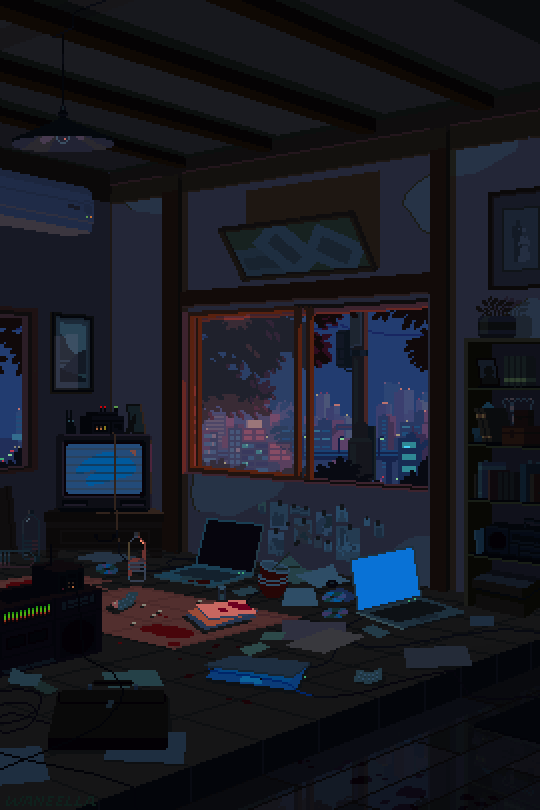

<!-- Banner Image -->
<p align="center">
  
</p>

#  🌳🌳"Intelligent men are more dangerous than the strom."

##  🌿Welcome, friend.
<!-- About ME -->

### About Me

<div class="about-main" style="display: flex;">
    <div align="left" style="display: flex; margin: 0px 70px 0px 15px; box-shadow: 10px 10px 13px -3px rgba(255,255,255,0.5);" class="about-left">
        
    </div>

```
https://github.com/muralikarthik07
```

```markdown
🎓 Pursuing a Bachelor's in Computer Science
👨‍💻 Passionate about programming and exploring the world of technology
🔎 Main interests: Web Development & Java
🔭 Thriving on building attractive frontend work
🌱 Currently diving into Java and Data Structures and Algorithms
💼 Open to collaboration on innovative Web development projects!
🩸 Coder by passion, tactician by nature
💀 Need challenges in life to grow
🕷 Believe in strategy over strength
🚩 Work smart, work unique, and work exceptional
🎧 May be thinking about something right now
🔥 Fate may be decided, but there's no proof it can't be changed
​​‎ ‎ ‎ ‎ ‎ ‎ ‎ ‎ ‎
```

  </div>
</div>

<br>

---
## ✨ Tools & Technologies
<!-- Tech Stack Table -->

<table align="center">
  <tr>
    <th>Frontend</th>
    <th>Backend</th>
    <th>Database</th>
    <th>Tools & Others</th>
  </tr>
  <tr>
    <td align="center">
      
      <br>
      
      <br>
      
      <br>
      
      <br>
      
      <br>
      
    </td>
    <td align="center">
      
      <br>
      
      <br>
      
      <br>
      
    </td>
    <td align="center">
      
      <br>
      
      <br>
      
    </td>
    <td align="center">
      
      <br>
      
      <br>
      
      <br>
      
    </td>
  </tr>
</table>

---

### 📈 GitHub Stats

<p align="center">
  
  
  
</p>

---

### 🩸 Final Thought

<p align="center">
  <strong>
    <em style="font-size: 22px; color: crimson;">
      "Ultimate goal is to grow,not to settle."
    </em>
  </strong>
</p>

---


